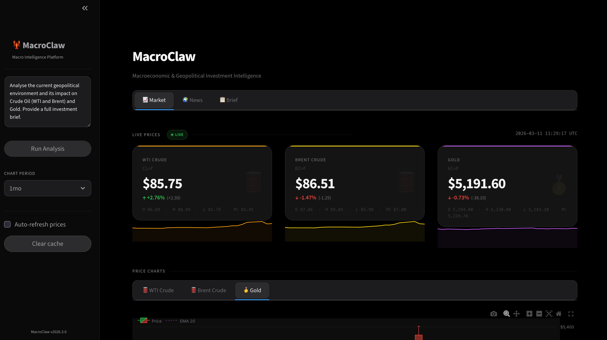

# 🦀 MacroClaw

> **Advanced Macroeconomic & Geopolitical Investment Intelligence Platform**

MacroClaw is an AI-powered investment analysis tool that monitors global geopolitical events and commodity markets in real time, synthesises them through an LLM-powered analytical engine, and delivers structured, actionable investment briefs — all from your terminal or a beautiful web dashboard.



---

## ✨ Features

### 🤖 Multi-Provider LLM Support
- **DeerAPI** — OpenAI + Anthropic gateway (recommended, supports `claude-opus-4-6`, `gpt-4o`, and more)
- **Anthropic API** — direct connection to `claude-opus-4-6`, `claude-sonnet-4-6`, etc.
- **OpenAI API** — direct connection to `gpt-4o`, `gpt-4-turbo`, etc.
- Auto-detects provider from the API key you set — no manual configuration needed

### 📰 Geopolitical Intelligence
- **GDELT Project API v2** — free, no key required, monitors 250+ news sources globally
- **NewsAPI.org** — supplementary source (optional API key, 100 req/day free tier)
- Automatic retry with exponential back-off on rate limits
- Tone/sentiment scoring on articles (negative = conflict/fear, positive = optimism)

### 📊 Commodity Market Data
- **yfinance** — real-time prices for WTI Crude (`CL=F`), Brent Crude (`BZ=F`), Gold (`GC=F`)
- **Forex & Currencies** — tracking US Dollar Index (`DX=F`), and Safe-havens JPY (`JPY=X`), CHF (`CHF=X`)
- **Alpha Vantage** — supplementary data source (optional API key)
- 1-month price history with OHLCV data for trend analysis

### 🧠 AI Analytical Engine
- **Multi-turn agent loop** — LLM collects data via tools, analyses correlations, then synthesises
- **Signal generation** — BULLISH / BEARISH / NEUTRAL for each tracked asset
- **Risk classification** — LOW / MEDIUM / HIGH with rationale
- **Correlation shortcuts** — e.g. Middle East escalation → WTI BULLISH + Gold BULLISH
- **Historical Backtesting** — SQLite integration to save signals and evaluate prediction accuracy over time
- **Session memory** — caches tool results to avoid redundant API calls

### 📋 Structured Investment Brief
Every analysis produces a JSON-structured investment brief containing:
- Executive summary of the macro environment
- Key geopolitical events with market impact assessment
- Per-asset price action with 1-month trend and geopolitical correlation
- Directional signals for WTI, Brent, Gold, DXY, JPY, and CHF
- Risk level with rationale
- Specific, actionable investment recommendations

### 🖥️ Apple-Inspired Dashboard
A sleek Streamlit dashboard with a dark aesthetic:
- **Market tab** — live price cards with sparklines, per-asset candlestick + EMA20 + volume charts, normalised performance comparison, risk gauge, and signal chart
- **News tab** — 2-column article grid with tone sentiment bars
- **Scoring & Win Rate tab** — Track historical LLM signals against actual market movements, complete with total accuracy tracking and signal history tables mapping LLM predictions to asset trends.
- **Brief tab** — structured investment brief display with one-click analysis trigger
- Auto-refresh prices, configurable chart period, proxy-aware HTTP

---

## 🚀 Quick Start

### 1. Clone & install

```bash
git clone https://github.com/Pengxiang-Li/MacroClaw.git
cd MacroClaw

python -m venv .venv
source .venv/bin/activate       # Windows: .venv\Scripts\activate

pip install -e .
```

### 2. Configure credentials

```bash
cp .env.example .env
```

Open `.env` and set **one** of the following (others are optional):

```env
# Option A — DeerAPI (supports both Claude and GPT models)
DEERAPI_KEY=your_deerapi_key_here

# Option B — Anthropic directly
# ANTHROPIC_API_KEY=your_anthropic_key_here

# Option C — OpenAI directly
# OPENAI_API_KEY=your_openai_key_here
```

### 3. Run

```bash
# Launch the interactive dashboard
macroclaw dashboard

# Run a one-shot analysis from the terminal
macroclaw analyse

# Custom query
macroclaw analyse "Impact of OPEC+ production cuts on energy markets"

# Validate your configuration
macroclaw config-check
```

---

## 📸 Dashboard

The MacroClaw dashboard provides a real-time view of commodity markets and geopolitical intelligence in three tabs:

| Tab | Contents |
|-----|----------|
| **📈 Market** | Live price cards (WTI, Brent, Gold, DXY, USD/JPY, USD/CHF), sparklines, candlestick charts with EMA20 & volume, normalised performance chart |
| **🌐 News** | Latest geopolitical articles from GDELT, tone sentiment bars, source metadata |
| **🎯 Scoring & Win Rate**| Historical backtesting UI tracking LLM predictions against actual market movements, tracking total accuracy |
| **📋 Brief** | Full AI-generated investment brief — executive summary, key events, commodity action, risk level, signals, recommendations |

---

## 🏗️ Architecture

```
macroclaw/
├── agents/
│   ├── agent_loop.py        # Multi-turn LLM loop (provider-agnostic)
│   ├── model_client.py      # Unified client: Anthropic + OpenAI + DeerAPI
│   ├── system_prompt.py     # Prompt builder with tool rules & output format
│   └── tool_registry.py     # Tool registration & dispatch
├── config/
│   └── config.py            # Pydantic Settings — all config from .env
├── dashboard/
│   └── app.py               # Streamlit dashboard (Apple dark aesthetic)
├── memory/
│   └── manager.py           # Session memory — caches tool results
├── output/
│   └── formatter.py         # Investment brief parser & Rich terminal formatter
└── tools/
    ├── base.py               # BaseTool ABC + ToolResult + ToolError
    ├── commodity_data_fetcher.py    # yfinance + Alpha Vantage
    └── geopolitical_news_fetcher.py # GDELT + NewsAPI
```

The agent loop is **provider-agnostic**: messages are maintained in Anthropic format internally; the OpenAI client transparently converts them on every request. Adding a new LLM provider requires only implementing `BaseModelClient.create_message()`.

---

## ⚙️ Configuration Reference

All configuration is via environment variables (`.env` file):

| Variable | Required | Default | Description |
|----------|----------|---------|-------------|
| `DEERAPI_KEY` | One of three | — | DeerAPI key ([deerapi.com](https://deerapi.com)) |
| `ANTHROPIC_API_KEY` | One of three | — | Anthropic API key |
| `OPENAI_API_KEY` | One of three | — | OpenAI API key |
| `LLM_PROVIDER` | No | auto | Override: `deerapi` \| `anthropic` \| `openai` |
| `MACROCLAW_MODEL` | No | `claude-opus-4-6` / `gpt-4o` | Model name |
| `MACROCLAW_MAX_TOKENS` | No | `8192` | Max tokens per LLM response |
| `MACROCLAW_MAX_TURNS` | No | `10` | Max agent loop turns |
| `NEWS_API_KEY` | No | — | NewsAPI.org key (supplements GDELT) |
| `ALPHA_VANTAGE_API_KEY` | No | — | Alpha Vantage key (supplements yfinance) |
| `MACROCLAW_LOG_LEVEL` | No | `INFO` | `DEBUG` \| `INFO` \| `WARNING` \| `ERROR` |

---

## 🛠️ CLI Reference

```
macroclaw                          Run default macro analysis
macroclaw analyse [QUERY]          Run analysis with optional custom query
  --model / -m MODEL               Override LLM model
  --max-turns / -t N               Override max agent turns
  --no-memory                      Disable session memory
  --log-level LEVEL                Set log verbosity
  --json-out                       Print raw JSON brief to stdout

macroclaw dashboard                Launch Streamlit dashboard
macroclaw config-check             Validate .env configuration
macroclaw --version                Show version
```

---

## 📦 Signals & Risk Framework

### Directional Signals

| Asset | BULLISH | BEARISH | NEUTRAL |
|-------|---------|---------|---------|
| **WTI / Brent** | Middle East escalation, OPEC cut, supply disruption | Demand weakness, recession, oversupply, OPEC increase | Mixed signals, range-bound |
| **Gold** | Geopolitical uncertainty, USD weakness, inflation | Strong USD, falling inflation, risk-on rally, rate hike | Consolidation, mixed macro |

### Correlation Rules
- **Oil supply shock** → Oil BULLISH + Gold BULLISH (inflation hedge)
- **Global recession fear** → Oil BEARISH + Gold BULLISH (safe haven)
- **USD strengthening** → Gold BEARISH (inverse correlation)
- **Geopolitical safe-haven demand** → Gold BULLISH regardless of oil direction

---

## 🔒 Security

- Your API keys are stored **only in `.env`** which is listed in `.gitignore` and never committed
- `.env.example` contains only placeholder values — safe to commit
- No keys are hardcoded anywhere in the source code

---

## 📄 License

MIT License — see [LICENSE](LICENSE) for details.

---

> **Disclaimer:** MacroClaw is an AI-generated analysis tool for informational purposes only. Output does not constitute personalised financial advice. Market prices may be delayed up to 15 minutes. Always conduct your own due diligence before making investment decisions.
